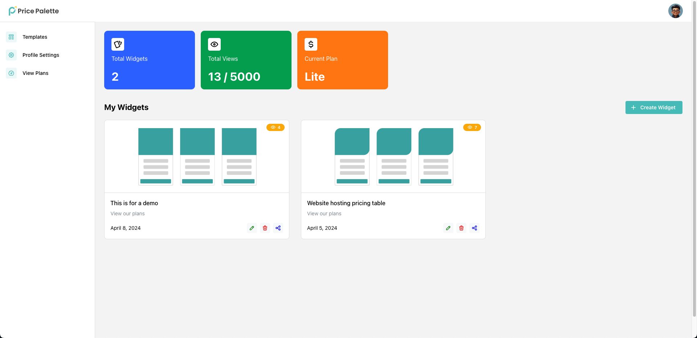
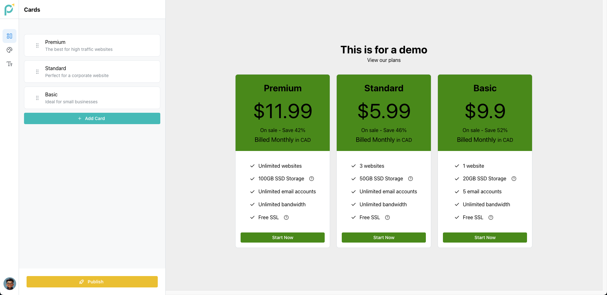
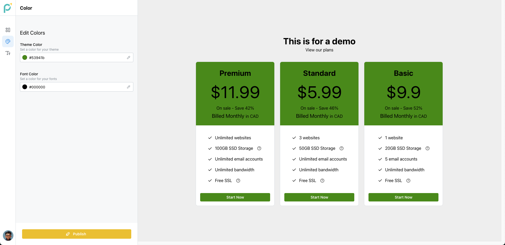
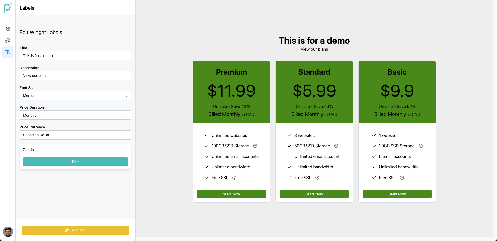

    

  <strong>Build fully customizable pricing widget for any web platform with Stripe integrated out of the box!</strong>

  <a href="https://youtu.be/bHuLCsmDNWI">Youtube Demo</a> -
  <a href="./openapi.json">OpenAPI docs</a>

## Business Problem

Imagine in today's world, we have to create pricing templates from scratch that involve complex coding or expensive specialists, leading to a frustrating process of constant updates when prices or packages change. This is considered an obstacle by small and medium enterprises who are small teams and they have to divert their focus from innovation to endless web development hassles. Gone are the days waiting to write lines of code, test and go live. This is where PricePalette comes to the rescue of such enterprises who do want to invest time in creating pricing templates on their websites but want to use pre-defined templates which are fully customizable. With PricePalette, if your pricing strategies are already decided, then just type in the details with one of our already available templates, and embed the code onto your company’s website. The widgets are already integrated with Stripe (payment gateway) and no business has to worry about integrating with any payment gateways.

## Structure

| Module                                                                         |        Description         |
| :----------------------------------------------------------------------------- | :------------------------: |
| [frontend](https://github.com/PricePalette/PricePalette/tree/main/frontend-v2) | React (Nextjs), TypeScript |
| [backend](https://github.com/PricePalette/PricePalette/tree/main/backend)      |      Python, Fast API      |

## Screenshots

### Dashboard Page

View the list of widgets that were created, with certain analytics like number of widgets created, views used so far in total, views of each widget and the current plan which the user is subscribed to on PricePalette.

### Edit Template Page

Templates can be customized and the user is provided option to edit the Card data, add cards, edit the colors, change the fonts and edit the labels.

Add a new card or re-arrange the order of cards

Change the theme color and font color of the cards by either entering a hex code or select from the color picker

Edit the fields associated with the template such as title, description, price duration, etc

## Team

- [Samreetha Williams](https://github.com/samreethawilliams)
- [Sahibjeet Singh](https://github.com/sahibjeetsingh99)
- [Pratik Sanjay Choudhari](https://github.com/pratik-choudhari)
- [Luqmaan Shaik](https://github.com/ShaikLuqmaan)
- [Joel Mathew Koshy](https://github.com/Rec0iL99)
